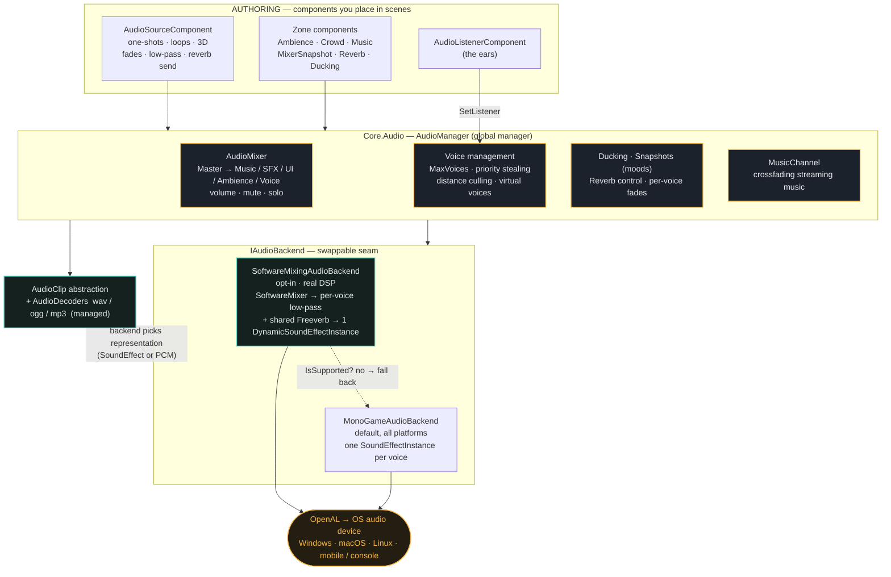
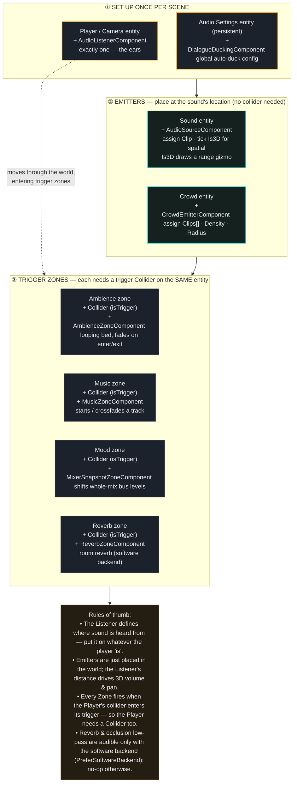

# Audio

A full-stack game audio system, from one-shot to reverb tail: a bussed mixer, 2D spatial sound, designer-placed zones for ambience, crowds, music and mood, real voice management, and an optional software-mixing backend with DSP for occlusion and reverb. Built on MonoGame, NativeAOT-safe, with pure-managed decoders for `wav`, `ogg` and `mp3`.

## Feature overview

The signal path has five stages:

| Stage | What happens |
|---|---|
| **Sources** | Components and zones start voices: one-shots, loops, positional sound. |
| **Mixer** | A bus tree with volume, mute and solo, ducking, and mood snapshots. |
| **Spatial** | Distance attenuation and pan relative to the listener. |
| **Voices** | Priority, instance caps, distance culling, virtual voices. |
| **Backend** | MonoGame or the software mixer, then DSP, then the output device. |

### Sources and playback

One component, `AudioSourceComponent`, covers fire-and-forget SFX, looping ambience, and 2D positional sound. Everything is live-tunable from the inspector while the game runs.

| Feature | API |
|---|---|
| One-shots and loops. Play a clip once or loop it as a tracked, controllable voice; overlapping SFX go fire-and-forget. | `AudioSourceComponent`, `Play()`, `Stop()` |
| 2D positional. Attenuate and pan by distance to the listener, with an inner full-volume radius and an outer silence radius. | `Is3D`, `MinDistance`, `MaxDistance` |
| Pitch, pan, volume. Per-voice controls synced every frame; inspector edits are heard instantly in Play mode. | `Volume`, `Pitch`, `Pan` |
| Random pitch. Vary pitch by a range per shot so repeated footsteps never sound machine-stamped. | `RandomPitchRange` |
| Fades and crossfade. Fade any voice in or out, fade to a level, or crossfade to a different clip. | `FadeIn`, `FadeOut`, `FadeTo`, `CrossfadeTo` |
| Priority and caps. Rank a source so it survives a crowded mix, and cap how many copies of one clip can stack. | `Priority`, `MaxInstances` |

### Zones and atmosphere

Drop a trigger volume, dial the levels, done. These components author a soundscape without code.

| Component | Purpose |
|---|---|
| `AmbienceZoneComponent` | Looping environmental beds that crossfade in on enter and out on exit. Overlapping zones blend. |
| `CrowdEmitterComponent` | Scatters randomized murmurs and footsteps around a point with a `Density` knob: a living crowd from one emitter. |
| `MusicZoneComponent` | Starts a track when the player enters a region; it crossfades from whatever was playing. |
| `MixerSnapshotZoneComponent` | Shifts the whole mix to a "mood" on enter as a smooth per-bus crossfade. |
| `DialogueDuckingComponent` | While anything plays on the Voice bus, music and ambience dip so speech stays clear, then recover. |
| `ReverbZoneComponent` | Makes a room, tunnel or cathedral reverberant while inside. Software backend only; a no-op elsewhere. |

### The mixer

A hierarchical bus tree, the mixing layer MonoGame lacks. Every voice routes through a named bus, so an options slider or a story beat can move whole categories at once.

```
Master
├── Music
├── SFX
├── UI
├── Ambience
└── Voice
```

| Feature | API |
|---|---|
| Volume, mute, solo. Per-bus gain folded down the parent chain, with a mixing-desk solo rule for auditioning. | `SetBusVolume`, `Bus(name)` |
| Ducking. Two independent duck factors, a transient sidechain hit and a sustained dialogue duck, that compose cleanly. | `Duck()`, auto-duck |
| Mood snapshots. Capture the mixer state and transition to it over time with a smoothstep ease. Master is left for the player's volume. | `CaptureSnapshot`, `TransitionTo` |

### Spatial and voice management

2D spatialization keeps crowded scenes legible, and a real voice manager keeps them under the platform's roughly 32-source ceiling.

| Feature | API |
|---|---|
| Distance and pan. Linear attenuation between min and max distance plus a stereo pan from the emitter's offset. | `AudioListenerComponent` |
| Priority stealing. When the pool is full, a newcomer steals the weakest voice only if it outranks it. | `MaxVoices` |
| Distance culling. Sounds beyond audible range never take a real voice; inaudible one-shots are dropped early. | `IsAudible` |
| Virtual voices. A far-away loop goes virtual, tracked but silent, and revives when back in range. | `IsVirtual` |
| Range gizmos. Every 3D source draws its reach in the editor: green is full volume, orange is silence, cyan is the crowd scatter radius. | `DebugRender` |
| Live tuning. Edit any audio component in Play mode, even while paused, and hear the change immediately. | `IUpdatableInPauseMode` |

### Backends and DSP

One swappable seam under everything. The default plays through MonoGame; an opt-in software mixer owns the PCM loop to unlock effects the per-sound path cannot do, and falls back where unsupported.

| Feature | API |
|---|---|
| Two backends. MonoGame per-voice playback (default), or a software mixer that sums every voice into one dynamic stream. | `IAudioBackend` |
| Clip abstraction. Components deal only in `AudioClip`, so the representation changes with the backend, not the code. | `AudioClip`, `LoadClip` |
| Capability fallback. The software backend probes the platform and falls back to MonoGame if unsupported; DSP no-ops there. | `IsSupported` |
| Occlusion low-pass. A per-voice low-pass cutoff muffles sounds behind walls or far away. | `LowPassCutoffHz` |
| Reverb send. A shared Freeverb (8 comb + 4 all-pass); each voice feeds it by a send amount driven by reverb zones. | `ReverbSend`, `SetReverb` |
| Managed decoders. `wav` (RIFF), `ogg` (NVorbis) and `mp3` (NLayer) decoded in managed code; AOT- and trim-safe. | `AudioDecoders` |

### Cost controls

Every place that can bound CPU or the voice pool is an explicit knob. Dial these per title, especially for mobile.

| Knob | Bounds |
|---|---|
| `MaxVoices` | Real voice ceiling |
| `MaxInstances` | Per-clip cap |
| `MaxConcurrent` | Crowd bits |
| `Density` | Crowd spawn rate |
| `SetReverbEnabled` | DSP toggle |
| SIMD | Vectorized output |

## Architecture: internal signal flow

How audio flows from the components you place, through the `AudioManager`, to the swappable backend and the OS.




## Setup: which entity gets which components

The practical composition guide for a game project.




## Enabling the software backend (DSP)

Reverb and occlusion low-pass require the software mixing backend. It's opt-in and set **before** the
`AudioManager` is constructed (there's a commented line in `Voltage.Editor/Program.cs`):

```csharp
Voltage.Audio.AudioManager.PreferSoftwareBackend = true;
```

It probes the platform and falls back to the MonoGame backend automatically where unsupported; DSP is then a
harmless no-op. Watch the console for a `[Audio] Using SoftwareMixingAudioBackend…` line to confirm.

## Muting and `IAudioComponent`

Any component that produces audio should implement `IAudioComponent` and register itself with `AudioComponentRegistry` so it respects the global mute toggle:

```csharp
public partial class FootstepPlayer : Component, IUpdatable, IAudioComponent
{
    private SoundEffect _sfx;
    private SoundEffectInstance _instance;

    public override void OnAddedToEntity()
    {
        AudioComponentRegistry.Register(this);
        _sfx = Entity.Scene.Content.LoadSoundEffect("Content/Audio/Footstep.wav");
        _instance = _sfx.CreateInstance();
    }

    public override void OnRemovedFromEntity()
    {
        AudioComponentRegistry.Unregister(this);
        _instance?.Dispose();
    }

    public void OnAudioStateChanged(bool isAudioOn)
    {
        if (!isAudioOn)
            _instance?.Pause();
        else if (_instance?.State == SoundState.Paused)
            _instance?.Resume();
    }

    public void Update()
    {
        if (Input.IsKeyPressed(Keys.Space) && Core.IsAudioOn)
            _instance.Play();
    }
}
```

`Core.IsAudioOn` — global read/write property. Setting it calls `Core.InvokeSwitchAudio`, which fires `Core.OnSwitchAudio` and applies `SoundEffect.MasterVolume` as a backstop for any audio that bypasses `IAudioComponent`.
